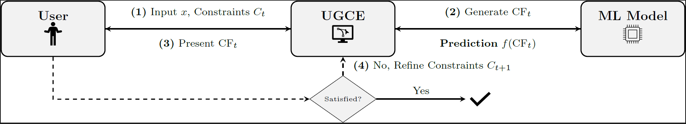

<div align="center">
<h1>UGCE: User-Guided Incremental Counterfactual Exploration</h1>

**Christos Fragkathoulas<sup>1,2</sup>, Evaggelia Pitoura<sup>1, 2</sup>**

<sup>1</sup>University of Ioannina,
<sup>2</sup>Archimedes, Athena Research Center, Greece

[](https://opensource.org/licenses/MIT)

</div>



<br>

This repository contains the official implementation of the paper: **UGCE: User-Guided Incremental Counterfactual Exploration**

## Contents

1.  [Abstract](#Abstract)
2.  [Installation](#installation)
3.  [Acknowledgement](#Acknowledgement)

## Abstract
Counterfactual explanations (CFEs) are a popular approach for interpreting machine learning predictions by identifying minimal feature changes that alter model outputs. However, in real-world settings, users often refine feasibility constraints over time, requiring counterfactual generation to adapt dynamically. Existing methods fail to support such iterative updates, instead recomputing explanations from scratch with each change, an inefficient and rigid approach.
We propose <em>User-Guided Incremental Counterfactual Exploration (UGCE)</em>, a genetic algorithm-based framework that incrementally updates counterfactuals in response to evolving user constraints.
Experimental results across five benchmark datasets demonstrate that UGCE significantly improves computational efficiency while maintaining high-quality solutions compared to a static, non-incremental approach. Our evaluation further shows that UGCE supports stable performance under varying constraint sequences, benefits from an efficient warm-start strategy, and reveals how different constraint types may affect search behavior.

## Installation

1.  Clone the repository:

    ```bash
    git clone [https://github.com/xristosfrag/UGCE-User-Guided-Counterfactual-Exploration](https://github.com/xristosfrag/UGCE-User-Guided-Counterfactual-Exploration)
    cd UGCE
    ```

2.  (Optional) Create a virtual environment:

    ```bash
    python -m venv venv
    source venv/bin/activate
    ```

3.  Install the required packages:

    ```bash
    pip install -r requirements.txt
    ```

## Acknowledgement
This work has been partially supported by project MIS 5154714 of the National Recovery and Resilience Plan Greece 2.0 funded by the European Union under the NextGenerationEU Program.